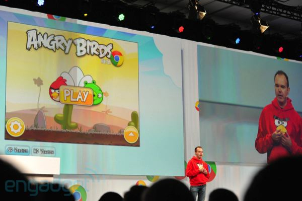

After releasing the Quake II port, we were approached by the Chrome DevRel team,
who were discussing working with Rovio to get Angry Birds running directly in
Chrome. It was a much simpler game, but it's also worth noting that shiny new
browser features like WebGL weren't widely available yet, so we had to find a
way to make it work across the browsers commonly found in the real world.

This meant creating an abstraction layer across all of WebGL, `<canvas>`, and
even simple HTML `<image>` elements with affine transforms, which turned out to
dramatically outperform canvas on some browsers at the time. The result was a
GWT library we called "PlayN" for implementing casual games. Rovio was porting
from their existing ActionScript implementation, so this proved a fairly direct
transliteration for the most part.

The resulting implementation worked quite well all things considered, and Rovio
announced it during the Google IO 2011
[keynote](https://www.engadget.com/2011-05-11-live-from-google-i-o-2011s-day-2-keynote.html).



Unfortunately, they seem to have decided to stop maintaining it at some point,
and the original chrome.angrybirds.com link no longer works. Still, it was a fun
project to work on, and it did take us one small step further towards commercially
successful games running directly in the browser.

Here are a couple of very old presentations I did at the time:
- [Angry Birds on HTML5](/slides/ab.html)
- [Introduction to the PlayN Game Library](/slides/playn.html)
