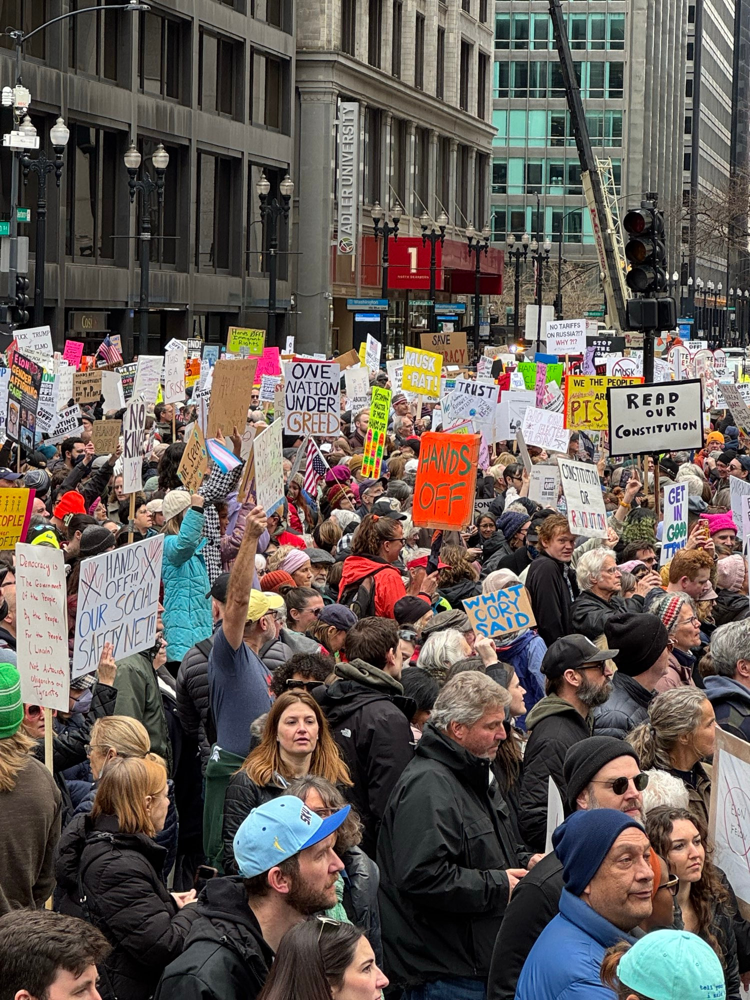
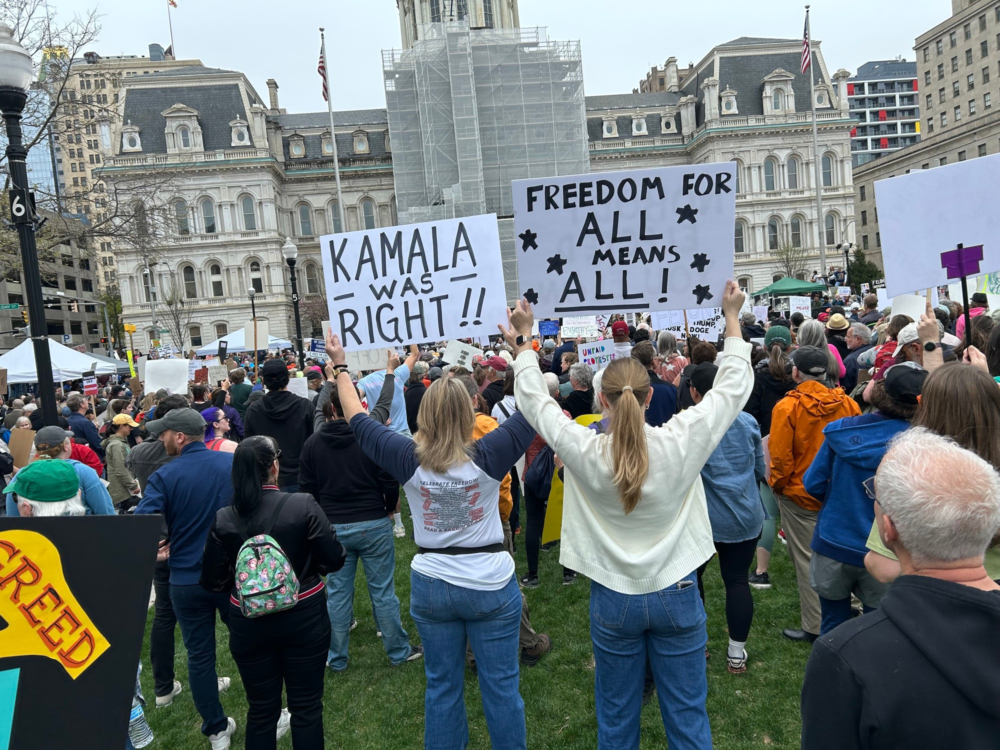
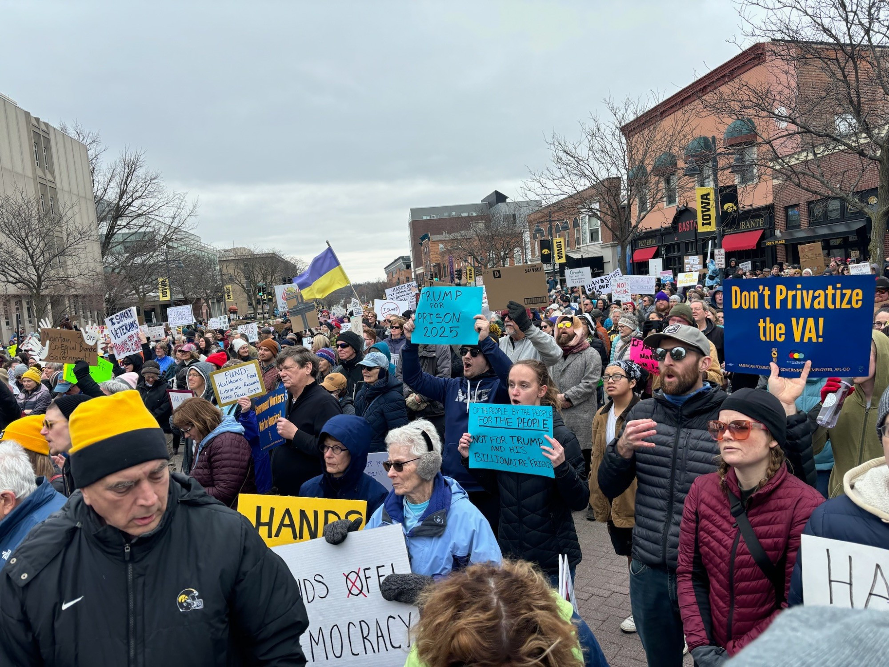
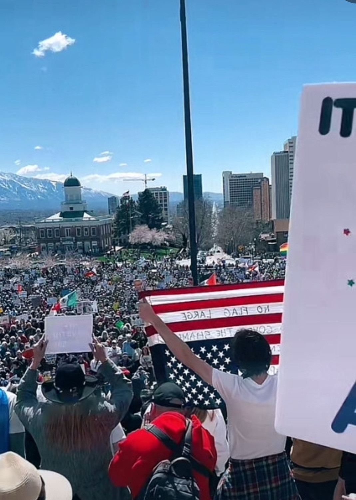
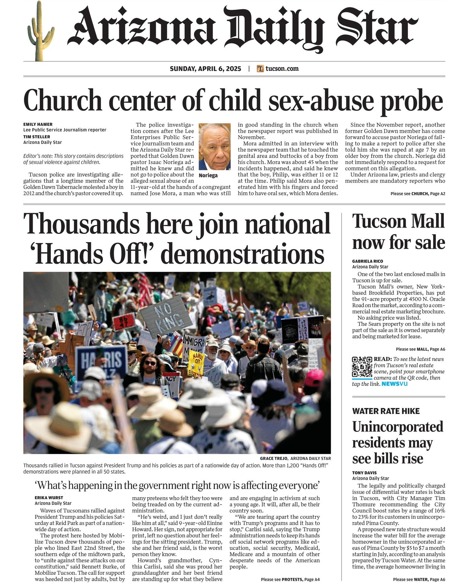

Yesterday, my family and I joined the Hands Off 2025 protest in Atlanta. It was an amazing, peaceful, well-organized event, with over 20,000 people marching from Piedmont Park to the capitol. It was heartening to see so many people come together to protest the seemingly unending stream of horrors and idiocy flowing from the Trump regime's clown car.

Later that day, it became clear that these protests had been huge. The photographs started streaming in from New York, with 5th Ave packed for miles, the National Mall completely packed, and thousands of people in cities large and small all over the country. We now know that [well over 100,000](https://www.axios.com/2025/04/05/hands-off-protest-movement-trump-musk) people took to the streets in New York and Washington, and nationwide estimates are running [as high as 3,000,000](https://bsky.app/profile/did:plc:f6gfdc4j4h7jbvs64lvpq2l5/post/3lm45ansyfk2i), across 1,300 or more protests. With so many hitting the streets, surely this would make a big impression on the public as a whole.

So we were looking forward to seeing the Sunday New York Times the following morning. When over a hundred thousand people clog up 5th Avenue on a Saturday, surely the 'Times would take notice for the Sunday edition headline? But when we unfurled the paper, the headline was unrelated. These massive protests were relegated to a two-column square, below the fold, referencing an article on page 19. The article itself referred to the protesters as "opponents of President Trump", "organized by Indivisible, MoveOn, and several other groups", with "a message that they say appeals to a politically diverse set of Americans". Which while not *in*accurate, completely missed the point.

# The Hall of Shame

As I began looking at other papers, both national and local, an unfortunate trend emerged -- many of the flagship papers, in the cities with the largest protests, had largely ignored the protests. And while I recognize that in 2025 the print editions of major newspapers are no longer most people's primary sources of information, they still carry outsize influence and serve as indicators of the media's priorities.

## New York
Here we have the 'Times front page, with a small square redirecting you to page 19. With a picture of people in
Asheville, NC, rather than the much larger protest in their own backyard. And one of the 'Post, on the off chance you were wondering what they made of it (i.e., nothing).

As of Monday morning, the Times not devoted more than a small link from the home page, which is now difficult to find, and I've not seen any mention of the fact that 5th Ave was filled with protesters on Saturday. The Daily podcast has also largely ignored the protests, leaving it to a broad, ten-second mention at the end. Where they mention "hundreds of thousands" of protesters, long after we are gaining certainty that the totals were in the millions.

  

    
    
    
    
  

  

    
    
  

## Washington DC
In Washington DC, where ["organizers said over 100,000 people gathered"](https://abcnews.go.com/Politics/huge-crowds-gather-hands-off-rallies-nationwide-protest/story?id=120523176) to protest the regime, the WaPo seems to have decided it was better to stick with the headline they already had, and go to bed early. They eventually added a [small link](https://www.washingtonpost.com/dc-md-va/2025/04/05/hands-off-protest-trump-washington/) to their home page, buried well below the fold.

  

    
    
    
    
  

  

    
  

## Boston
How about Boston, where ["nearly 100,000 protesters"](https://www.cbsnews.com/boston/news/hands-off-protest-boston-massachusetts/) turned out? Crickets from the Globe. As of Monday morning, no trace remains on the Globe's home page.

  

    
    
  

  

    
  

## Chicago
In Chicago, [around 30,000 protestors](https://www.fox32chicago.com/news/anti-trump-musk-rally-chicago-today) gathered in Daley Plaza. But you wouldn't see anything about that in the Sunday Tribune. The only coverage on the web site is a "trending" [link](https://www.chicagotribune.com/2025/04/05/thousands-rally-march-through-loop-for-national-hands-off-protest/) next to an article about backyard chickens: 

  

    
    
    
    
  

  

    
    
  

## New Jersey
How about Jersey? Large turnouts across the state, including a fiery speech from Senator Cory Booker, which is notable given his recent history-making filibuster, merited not a single front-page mention from any New Jersey paper I could find.

  

    
    
    
  

  

    
    
    
  

## Atlanta
I shouldn't be surprised that my own city's Journal-Constitution didn't think 20,000 people streaming through the city's streets warranted a mention. But the "state senate taking off work early" was front-page news. The [only article](https://www.ajc.com/news/atlanta-news/thousands-march-to-georgia-capitol-condemning-trumps-tariffs-government-purge/4GP6TBJTCVCKPGLWLGUE2Q6HXM/) was given a small link near the bottom of the home page.

  

    
    
  

  

    
  

## Baltimore
What did the Baltimore Sun have to say about the protests there?

  

    
    
    
    
  

  

    
  

## Pittsburgh
Pittsburgh saw surprisingly-large protests. The Pittsburgh Gazette, however, did not. Sports apparently ranks more highly than Democracy.

  

    
    
  

  

    
  

## Austin
In Austin, the Statesman appears to have run a full-page cover about health bills. As of Monday morning, there is not a single article linked from their home page about the protests.

  

    
    
    
  

  

    
  

## Miami
In Miami, golf appears to be more important than the fall of Democracy.

  

    
    
    
  

  

    
  

## Denver
Denver? Not according to the Denver Post home page.

*Note: If anyone can find an image of the Denver Post front page from April 6, 2025, I'd appreciate it.*

  

    
    
    
    
    
  

  

    
  

## Dallas
Looks like a lot of people protesting in downtown Dallas, but the Dallas Morning News was, perhaps unsurprisingly, silent.

  

    
    
  

  

    
  

## Boise
Boise had a remarkable turnout, but nothing from the Idaho Statesman front pages, either in the Sunday edition, or on their web site.

  

    
    
    
  

  

    
  

# Honorable Mentions
In many other cities, the coverage was spotty at best, with the big headlines relegated to smaller and regional papers. At least _someone_ covered them, but not the major papers of record.

## Los Angeles
In Los Angeles, the LA Times decided that these protests didn't merit a spot on the Sunday front page, though the San Diego Tribune saw it quite differently.

  

    
    
    
    
    
  

  

    
    
  

## San Francisco
You'd think the SF Chronicle would consider these protests important, but... nope. They left that to the Mercury News.

  

    
    
    
    
  

  

    
    
  

## Iowa
Iowa's population may be a bit more diffuse than many states; yet they still saw significant protests. And at least the Iowa Gazette saw fit to notice.

  

    
    
    
  

  

    
    
  

## Portland OR
It is perhaps unsurprising that the Oregonian covered Portland's large protests, though other papers in the region did not.

  

    
    
    
  

  

    
    
  

## Providence
Good on Rhode Island's Westerly Sun for devoting most of their front page to the protests, though the Providence Journal saw fit to run a full page spread about the state police instead.

  

    
    
  

  

    
    
  

# Nailed It

And then there are those papers that devoted clear coverage on their front pages to the protests. Even in some cities where the protests may not have been as large as places like New York and Washington DC. Proving that it was both important, and possible to hit the Sunday edition deadlines.

## Seattle
Among large cities, the Seattle Times stands out for its direct coverage.

  

    
    
    
    
  

  

    
  

## Minneapolis - St Paul
The Twin Cities papers were clear and direct in their coverage: "People are Waking Up".

  

    
    
  

  

    
    
  

## Portland Maine
The Portland Herald accurately describes the protests there as a "groundswell of everyday people". Contrast this with the New York Times' focus on the politics and organizations.

  

    
    
    
  

  

    
  

## Salt Lake City
Salt Lake saw a huge protest, and kudos to the Salt Lake Tribune for noticing.

*Note: If anyone has their actual front page from April 6, 2025, please send a copy!*

  

    
    
    
    
  

  

    
  

## Arizona
Arizona papers covered their protests front and center.

  

    
    
    
  

  

    
    
  

## Philadelphia
The Philadelphia Inquirer devoted top billing to the protests in their city.

  

    
    
  

  

    
  

## Virginia
Look at the front-page spread the Virginian-Pilot dedicated to protests across the state.

  

    
    
    
  

  

    
  

## Alaska
Alaskans turned out in significant percentages, and were informed of it clearly the next morning by the Anchorage Daily News.

  

    
    
    
    
    
  

  

    
  

## New Mexico
Albuquerque and Santa Fe saw large protests, and the Albuquerque Journal had it on their home page immediately.

*Note: I'd love a copy of the Albuquerque Journal or any other New Mexico front pages anyone can find.*

  

    
    
    
    
  

  

    
  

